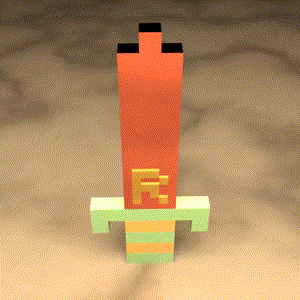
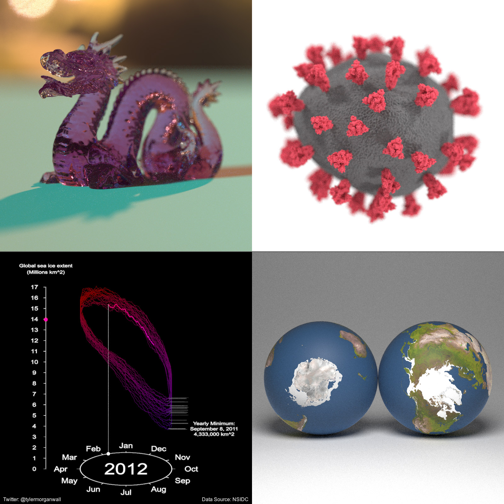

rayrender
=========================================================

<!-- badges: start -->
[](https://github.com/tylermorganwall/rayrender/actions)
[](https://tylermorganwall.r-universe.dev/)
[](https://tylermorganwall.r-universe.dev/rayrender)

<!-- badges: end -->

</img>

Overview
--------

**rayrender** is an open source R package for raytracing scenes in created in R. This package provides a tidy R interface to a fast pathtracer written in C++ to render scenes built out of an array of primitives and meshes. **rayrender** builds scenes using a pipeable iterative interface, and supports diffuse, metallic, dielectric (glass), glossy, microfacet, light emitting materials, as well as procedural and user-specified image/roughness/bump/normal textures and HDR environment lighting. **rayrender** includes multicore support (with progress bars) via RcppThread, random number generation via the PCG RNG, OBJ/PLY support, and denoising support with Intel Open Image Denoise (OIDN).

Browse the documentation and see more examples at the website (if you aren't already there):

<a href="https://www.rayrender.net">rayrender.net</a>

</img>


Installation
------------

```r
# To install the latest version from Github:
# install.packages("devtools")
devtools::install_github("tylermorganwall/rayrender")
```

# Optional: denoising with Intel Open Image Denoise (OIDN)

`rayrender` can use Intel Open Image Denoise to denoise rendered images when OIDN is available on your system.
If OIDN is not found, `rayrender` will still work, just without denoising support.

To get denoising support, you need to install OIDN. You can download the official binaries from Intel and set the `OIDN_PATH` argument in your .Renviron file with the following command line instructions:

## macOS

``` bash
# Download the appropriate binary for your architecture
curl -LO https://github.com/OpenImageDenoise/oidn/releases/download/v2.3.1/oidn-2.3.1.x86_64.macos.tar.gz
# or for Apple Silicon
curl -LO https://github.com/OpenImageDenoise/oidn/releases/download/v2.3.1/oidn-2.3.1.arm64.macos.tar.gz

# Extract the archive
tar -xvzf oidn-2.3.1.x86_64.macos.tar.gz
# or for Apple Silicon
tar -xvzf oidn-2.3.1.arm64.macos.tar.gz

# Set OIDN_PATH in your .Renviron file to the extracted directory
echo "OIDN_PATH=/path/to/extracted/oidn" >> ~/.Renviron
```

## linux

``` bash
# Download the binary
curl -LO https://github.com/OpenImageDenoise/oidn/releases/download/v2.3.1/oidn-2.3.1.x86_64.linux.tar.gz

# Extract the archive
tar -xvzf oidn-2.3.1.x86_64.linux.tar.gz

# Set OIDN_PATH in your .Renviron file to the extracted directory
echo "OIDN_PATH=/path/to/extracted/oidn" >> ~/.Renviron
```

## Windows (Rtools45)

Windows is slightly trickier and requires Rtools45. The steps are:

1. Install `make` and `ninja` via RTools.
2. Install **ISPC** (Intel SPMD Program Compiler).
3. Download the **OIDN** source repository.
4. Compile and install OIDN, and point `rayrender` to it via `OIDN_PATH`.

`OIDN_PATH` should point to a directory that contains `include/OpenImageDenoise` and `lib` (or `lib64`) with the OIDN libraries.

### Install prerequisites

1. Install **Rtools45**
   <https://cran.r-project.org/bin/windows/Rtools/>
2. Open the **“Rtools45 MinGW UCRT64”** shell (ucrt64) in **RTools45**.
3. Inside that shell, install the build tools (including `make`, `ninja`, `cmake`, `git`, and `ispc`) via `pacman`:

```bash
pacman -Sy --needed \
	mingw-w64-ucrt-x86_64-make \
	mingw-w64-ucrt-x86_64-ninja \
	mingw-w64-ucrt-x86_64-cmake \
	mingw-w64-ucrt-x86_64-git \
	mingw-w64-ucrt-x86_64-ispc
```
4. Make sure the Rtools static-posix toolchain and the MinGW binaries are on PATH (this mirrors the setup used to build OIDN):

```bash
export PATH="/c/rtools45/x86_64-w64-mingw32.static.posix/bin:/mingw64/bin:${PATH}"
```

5. Verify the toolchain:

```bash
gcc --version
g++ --version
make --version
ninja --version
cmake --version
ispc --version
```

5. Install **ISPC** in the same ucrt64 environment:

```bash
pacman -Sy mingw-w64-ucrt-x86_64-ispc
```

* Otherwise, download a prebuilt ISPC binary from the ISPC website, unpack it somewhere (e.g. `C:/local/ispc`), and add its `bin` directory to `PATH` inside the ucrt64 shell:

```bash
export PATH="/c/local/ispc/bin:${PATH}"
```

6. Confirm ISPC is visible:

```bash
ispc --version
```

## Build and install OIDN from source (CPU-only)

All of the following commands are run from the **Rtools45 ucrt64 shell**:

```bash
# Download the OIDN source
git clone --recursive https://github.com/RenderKit/oidn.git
cd oidn

# Create a separate build directory
mkdir build-cpu-static
cd build-cpu-static

# Choose an install prefix; use a simple path without spaces
# This will become C:/local/oidn-static on Windows
OIDN_PREFIX="C:/local/oidn-static"

# Configure OIDN with the Rtools static-posix toolchain, CPU-only, static lib
# Update with your rtools45 path.
"/path/to/rtools45/x86_64-w64-mingw32.static.posix/bin/cmake.exe" \
  -G "Ninja" \
  -DCMAKE_BUILD_TYPE=Release \
  -DCMAKE_C_COMPILER="/path/to/rtools45/x86_64-w64-mingw32.static.posix/bin/gcc.exe" \
  -DCMAKE_CXX_COMPILER="/path/to/rtools45/x86_64-w64-mingw32.static.posix/bin/g++.exe" \
  -DOIDN_STATIC_LIB=ON \
  -DOIDN_DEVICE_CPU=ON \
  -DOIDN_DEVICE_SYCL=OFF \
  -DOIDN_DEVICE_CUDA=OFF \
  -DOIDN_DEVICE_HIP=OFF \
  -DOIDN_DEVICE_METAL=OFF \
  -DOIDN_APPS=OFF \
  -DISPC_EXECUTABLE="$(command -v ispc)" \
  -DTBB_DIR="/path/to/rtools45/x86_64-w64-mingw32.static.posix/lib/cmake/TBB" \
  -DCMAKE_INSTALL_PREFIX="${OIDN_PREFIX}" \
  ..
```

If CMake cannot find TBB in Rtools automatically, add a hint such as:

```bash
-DTBB_ROOT=/path/to/rtools45/x86_64-w64-mingw32.static.posix
```
(adjust the path for your actual Rtools45 install) to the `cmake` command above.

Then build and install:

```bash
ninja
ninja install
```

After installation you should have, for example:

```text
C:/local/oidn/include/OpenImageDenoise/oidn.h
C:/local/oidn/lib/libOpenImageDenoise.a   (and related libs)
```

## Tell R where OIDN lives

In a regular Windows shell or PowerShell, add to your user `.Renviron`:

```powershell
echo 'OIDN_PATH=C:/local/oidn' >> "$HOME/.Renviron"
```

or edit the file and add the above manually with `devtools::edit_r_environ()`.

Restart R (or your IDE), then reinstall `rayrender` from source:

```r
devtools::install_github("tylermorganwall/rayrender", force = TRUE)
```

After this, `rayrender` should detect OIDN during `configure` and enable denoising support on Windows.

Usage
-----

```{r setup, include=FALSE}
knitr::opts_chunk$set(
  fig.path = "man/figures/",
  dpi = 100,
  fig.width = 8,
  fig.height = 8
)
library(rayrender)
```

We'll first start by rendering a simple scene consisting of the ground, a sphere, and the included `R.obj` file. The location of the `R.obj` file can be accessed by calling the function `r_obj()`. First adding the ground using the `render_ground()` function. This renders an extremely large sphere that (at our scene's scale) functions as a flat surface. We also add a simple blue sphere to the scene.

```{r README_ground,cache=TRUE, message=FALSE}
library(rayrender)

scene = generate_ground(material=diffuse(checkercolor="grey20")) %>%
  add_object(sphere(y=0.2,material=glossy(color="#2b6eff",reflectance=0.05))) 
render_scene(scene, parallel = TRUE, width = 800, height = 800, samples = 64)
```

By default, a scene without any lights includes a blue sky. We can turn this off either by setting `ambient_light = FALSE`, or by adding a light to our scene. We will add an emissive sphere above and behind our camera.

```{r README_ground_sphere,cache=TRUE, message=FALSE}
scene = generate_ground(material=diffuse(checkercolor="grey20")) %>%
  add_object(sphere(y=0.2,material=glossy(color="#2b6eff",reflectance=0.05))) %>%
  add_object(sphere(y=10,z=1,radius=4,material=light(intensity=4))) %>%
  add_object(sphere(z=15,material=light(intensity=70)))
render_scene(scene, parallel = TRUE, width = 800, height = 800, samples = 64)
```

Now we'll add the (included) R .obj file into the scene, using the `obj_model()` function. We will scale it down slightly using the `scale_obj` argument, and then embed it on the surface of the ball. 


```{r README_ground_r_path,cache=TRUE, message=FALSE}
scene = generate_ground(material=diffuse(checkercolor="grey20")) %>%
  add_object(sphere(y=0.2,material=glossy(color="#2b6eff",reflectance=0.05))) %>%
  add_object(obj_model(r_obj(simple_r = TRUE),
                       z=1,y=-0.05,scale_obj=0.45,material=diffuse())) %>%
  add_object(sphere(y=10,z=1,radius=4,material=light(intensity=4))) %>%
  add_object(sphere(z=15,material=light(intensity=70)))
render_scene(scene, parallel = TRUE, width = 800, height = 800, samples = 64)
```

Here we'll render a grid of different viewpoints.

```{r README_ground_grid,cache=TRUE, message=FALSE}
filename = tempfile()
image1 = render_scene(scene, parallel = TRUE, width = 400, height = 400, 
             lookfrom = c(7,1,7), samples = 64, return_raw_array = TRUE)
image2 = render_scene(scene, parallel = TRUE, width = 400, height = 400, 
             lookfrom = c(0,7,7), samples = 64, return_raw_array = TRUE)
image3 = render_scene(scene, parallel = TRUE, width = 400, height = 400, 
             lookfrom = c(-7,0,-7), samples = 64, return_raw_array = TRUE)
image4 = render_scene(scene, parallel = TRUE, width = 400, height = 400, 
             lookfrom = c(-7,7,7), samples = 64, return_raw_array = TRUE)
rayimage::plot_image_grid(list(image1,image2,image3,image4), dim = c(2,2))

```

Here's another example: We start by generating an empty Cornell box and rendering it with `render_scene()`. Setting `parallel = TRUE` will utilize all available cores on your machine. The `lookat`, `lookfrom`, `aperture`, and `fov` arguments control the camera, and the `samples` argument controls how many samples to take at each pixel. Higher sample counts result in a less noisy image.

```{r README_basic, cache=TRUE, message=FALSE}
scene = generate_cornell()
render_scene(scene, lookfrom=c(278,278,-800),lookat = c(278,278,0), aperture=0, fov=40, samples = 64,
             ambient_light=FALSE, parallel=TRUE, width=800, height=800)
```

Here we add a metal ellipsoid, a checkered purple cube, a colored glass sphere, a pig, and plaster the walls with the iris dataset using textures applied to rectangles. We first write the textures out to a temporary filename, and then read the image back in using the `png::readPNG()` function. We then pass this to the `image` argument in the diffuse material, which applies it as a texture.

```{r README_basic_sphere,cache=TRUE, message=FALSE}
tempfileplot = tempfile()
png(filename=tempfileplot,height=1600,width=1600)
plot(iris$Petal.Length,iris$Sepal.Width,col=iris$Species,pch=18,cex=12)
dev.off()
image_array = png::readPNG(tempfileplot)

generate_cornell() %>%
  add_object(ellipsoid(x=555/2,y=100,z=555/2,a=50,b=100,c=50, material = metal(color="lightblue"))) %>%
  add_object(cube(x=100,y=130/2,z=200,xwidth = 130,ywidth=130,zwidth = 130,
                  material=diffuse(checkercolor="purple", checkerperiod = 30),angle=c(0,10,0))) %>%
  add_object(pig(x=100,y=190,z=200,scale=40,angle=c(0,30,0))) %>%
  add_object(sphere(x=420,y=555/8,z=100,radius=555/8,
                    material = dielectric(color="orange"))) %>%
  add_object(yz_rect(x=0.01,y=300,z=555/2,zwidth=400,ywidth=400,
                     material = diffuse(image_texture = image_array))) %>%
  add_object(yz_rect(x=555/2,y=300,z=555-0.01,zwidth=400,ywidth=400,
                     material = diffuse(image_texture = image_array),angle=c(0,90,0))) %>%
  add_object(yz_rect(x=555-0.01,y=300,z=555/2,zwidth=400,ywidth=400,
                     material = diffuse(image_texture = image_array),angle=c(0,180,0))) %>%
  render_scene(lookfrom=c(278,278,-800),lookat = c(278,278,0), aperture=0, fov=40,  samples = 64,
             ambient_light=FALSE, parallel=TRUE, width=800, height=800)
```

Rayrender also has an interface to create objects using constructive solid geometry, with a wide variety of primitives and operations. 

```{r, cache=TRUE}

generate_ground(material=diffuse(checkercolor="grey20")) %>%
  add_object(csg_object(csg_combine(
    csg_combine(
      csg_box(),
      csg_sphere(radius=0.707),
      operation="intersection"),
    csg_group(list(csg_cylinder(start=c(-1,0,0), end=c(1,0,0), radius=0.4),
                   csg_cylinder(start=c(0,-1,0), end=c(0,1,0), radius=0.4),
                   csg_cylinder(start=c(0,0,-1), end=c(0,0,1), radius=0.4))),
    operation="subtract"),
    material=glossy(color="red"))) %>%
  add_object(csg_object(csg_translate(csg_combine(
    csg_onion(csg_onion(csg_onion(csg_sphere(radius=0.3), 0.2), 0.1),0.05),
    csg_box(y=1,width=c(10,2,10)), operation = "subtract"), x=1.3),
    material=glossy(color="purple"))) %>%
  add_object(csg_object(csg_combine(
     csg_sphere(x=-1.2,z=-0.3, y=0.5,radius = 0.4),
     csg_sphere(x=-1.4,z=0.4, radius = 0.4), operation="blend", radius=0.5),
     material=glossy(color="dodgerblue4"))) %>%
  add_object(sphere(y=5,x=3,radius=1,material=light(intensity=30))) %>%
  render_scene(clamp_value=10, fov=20,lookfrom=c(5,5,10),samples=64,width=800,height=800)

```

We can also use the `path()` element to draw 3D paths. Here, we render the Lorenz attractor:

```{r README_ground_r_lorenz,cache=TRUE, message=FALSE}
library(deSolve)
parameters = c(s = 10, r = 28, b = 8/3)
state = c(X = 1, Y = 0, Z = 1)

Lorenz = function(t, state, parameters) {
  with(as.list(c(state, parameters)), {
    dX = s * (Y - X)
    dY = X * (r - Z) - Y
    dZ = X * Y - b * Z
    list(c(dX, dY, dZ))
  })
}

times = seq(0, 50, by = 0.05)
vals = ode(y = state, times = times, func = Lorenz, parms = parameters)[,-1]

#scale and rearrange:
vals = vals[,c(1,3,2)]/20

generate_studio() %>% 
  add_object(path(points=vals,y=-0.6,width=0.01,material=diffuse(color="red"))) %>% 
  add_object(sphere(y=5,z=5,radius=0.5,material=light(intensity=200))) %>% 
  render_scene(samples=64,lookat=c(0,0.5,0),lookfrom=c(0,1,10),width = 800, height = 800, parallel=TRUE)
```

rayrender also supports an extruded path object that generates a variable width path with any non-intersecting simple polygon (including holes) as an input. You can vary the width, add twist, and change the shape of the polygon along the path's length.

```{r README_r_extruded_path, cache=TRUE, message=FALSE}
points = list(c(0,0,1),c(-0.5,0,-1),c(0,1,-1),c(1,0.5,0),c(0.6,0.3,1))
#Create star polygon
angles = seq(0,360,by=36)
xx = rev(c(rep(c(1,0.5),5),1) * sinpi(angles/180))
yy = rev(c(rep(c(1,0.5),5),1) * cospi(angles/180))
star_polygon = data.frame(x=xx,y=yy)

#Extrude a path using a star polygon
generate_studio(depth=-0.4) |>
  add_object(extruded_path(points = points, width=abs(cospi(seq(0,4,by=0.01)))/4,
                           polygon = star_polygon,
                           twists = 4,
                           breaks = 1000,
                           material=diffuse(color="purple"))) |>
  add_object(sphere(y=3,z=5,x=2,radius=1,material=light(intensity=15))) |>
  render_scene(lookat=c(0.3,0.5,1), 
               fov=12, width=800,height=800, 
               aperture=0.025, samples=64)

#Render a closed Mobius strip with 1.5 turns 
points = list(c(0,0,0),c(0.5,0.5,0),c(0,1,0),c(-0.5,0.5,0))
square_polygon = matrix(c(-1, -0.1, 0,
                           1, -0.1, 0,
                           1,  0.1, 0,
                          -1,  0.1, 0)/10, ncol=3,byrow = T)

generate_studio(depth=-0.2,
               material=diffuse(color = "dodgerblue4", checkercolor = "#002a61",
                                checkerperiod = 1)) |>
 add_object(extruded_path(points = points,  polygon=square_polygon, closed = TRUE,
                          linear_step = TRUE, twists = 1.5, breaks = 720, 
                          material = diffuse(noisecolor = "black", noise = 10, 
                                             noiseintensity = 10))) |>
 add_object(sphere(y=20,x=0,z=21,material=light(intensity = 1000))) |> 
 render_scene(lookat=c(0,0.5,0), fov=10, samples=64,
              width = 800, height=800)
```

Finally, rayrender supports environment lighting with the `environment_light` argument. Pass a high dynamic range image (`.hdr`) or a low-dynamic range image (`.jpg`,`.png`) and the image will be used to light the scene (along with any other lights). Here's an example using an HDR image of Venice at sunset (obtained for free from hdrihaven.com), also using the Oren-Nayar diffuse model with `sigma = 90` for a more realistic diffuse surface. We also add an extruded polygon star, using the `extruded_polygon` object.

```{r README_hdr, cache=TRUE, message=FALSE}
tempfilehdr = tempfile(fileext = ".hdr")
download.file("https://www.tylermw.com/data/venice_sunset_2k.hdr",tempfilehdr, mode="wb")
hollow_star = rbind(star_polygon, 0.8 * star_polygon)

generate_ground(material = diffuse(color="grey20", checkercolor = "grey50",sigma=90)) %>%
  add_object(sphere(material=microfacet(roughness = 0.2,
                                        eta=c(0.216,0.42833,1.3184), kappa=c(3.239,2.4599,1.8661)))) %>%
  add_object(obj_model(y=-1,x=-1.8,r_obj(simple_r = TRUE), 
                       angle=c(0,135,0),material = diffuse(sigma=90))) %>%
  add_object(pig(x=1.8,y=-1.2,scale=0.5,angle=c(0,90,0),diffuse_sigma = 90)) %>%
  add_object(extruded_polygon(hollow_star,top=-0.5,bottom=-1, z=-2,
                              holes = nrow(star_polygon),
                              material=diffuse(color="red",sigma=90))) %>%
  render_scene(parallel = TRUE, environment_light = tempfilehdr, width=800,height=800,
               fov=70,samples=64, aperture=0.1, sample_method = "sobol_blue",
               lookfrom=c(-0.9,1.2,-4.5),lookat=c(0,-1,0))

```

Acknowledgments 
--------

Thanks to Brodie Gaslam (@brodieG) for contributions to the `extruded_polygon()` function.
