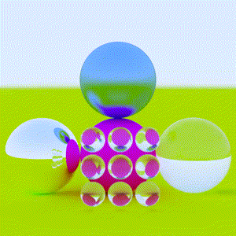
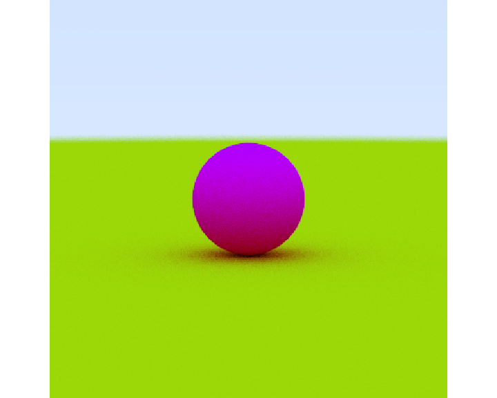
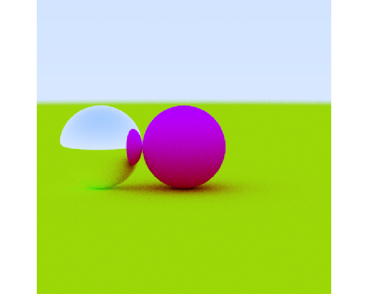
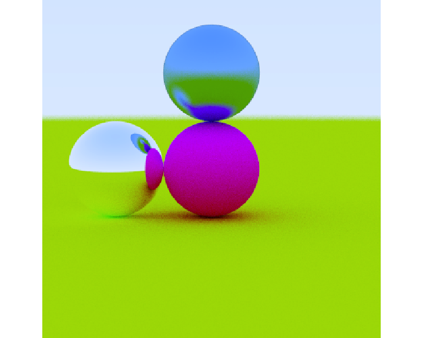
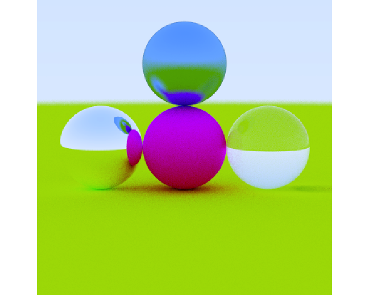
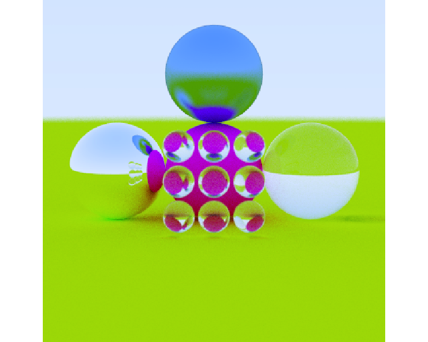
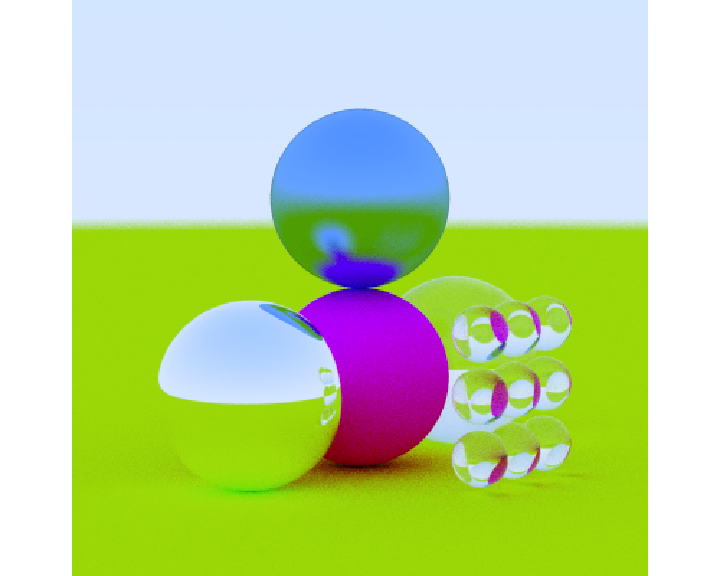
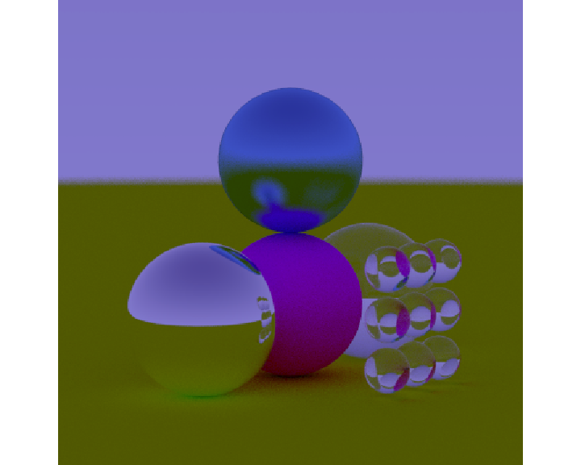
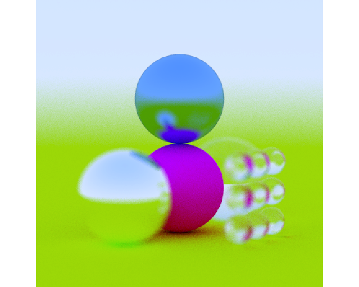

# rayballer

</img>

## Overview

**rayballer** is an open source R package for raytracing spheres. Based
off of Peter Shirley’s “Raytracing in One Weekend” book, this package
provides a tidy R API to the underlying raytracer to build scenes out of
diffuse (lambertian), metallic, and glass (dielectric) spheres. The
scene representation is a tibble of sphere properties, and the user can
use the provided material helper functions to easily build the scene out
of individual spheres.

## Installation

``` r
# To install the latest version from Github:
# install.packages("devtools")
devtools::install_github("tylermorganwall/rayballer")
```

## Usage

``` r
library(rayballer)

#Start with the ground
scene = generate_ground(depth=-0.5)
render_scene(scene)
```

<!-- -->

``` r
#Add a sphere to the center
scene = add_sphere(scene, lambertian(x=0,y=0,z=0,radius=0.5,color=c(1,0,1)))
render_scene(scene)
```

<!-- -->

``` r
#Add a metal ball (using hexcode color representation)
scene = add_sphere(scene, metal(x=0,y=0,z=1,radius=0.5,color="#ffffff",fuzz=0))
render_scene(scene)
```

<!-- -->

``` r
#Add a brushed metal ball 
scene = add_sphere(scene, metal(x=0,y=1,z=0,radius=0.5,color=c(0.3,0.6,1),fuzz=0.25))
render_scene(scene)
```

<!-- -->

``` r
#Add a dielectric (glass) ball
scene = add_sphere(scene, dielectric(x=0,y=0,z=-1,radius=0.5,refraction=1.6))
render_scene(scene)
```

<!-- -->

``` r
#Add a grid of glass balls in front
glass_array_list = list() 

yloc = seq(-0.33,+0.33,length.out=3)
zloc = seq(-0.33,0.33,length.out=3)
locations = expand.grid(y=yloc,z=zloc)
for(i in 1:9) {
  glass_array_list[[i]] = dielectric(x=1,y=locations$y[i],z=locations$z[i], radius=0.15)
}
glass_array = do.call(rbind,glass_array_list)

scene = add_sphere(scene, glass_array)
render_scene(scene)
```

<!-- -->

``` r
#Move the camera
render_scene(scene,lookfrom = c(7,1.5,10),lookat = c(0,0.5,0),fov=15)
```

<!-- -->

``` r
#Change the background gradient to a night time ambience
render_scene(scene,lookfrom = c(7,1.5,10),lookat = c(0,0.5,0),fov=15,
                 backgroundhigh = "#282375", backgroundlow = "#7e77ea")
```

<!-- -->

``` r
#'#Increase the aperture to give more depth of field.
render_scene(scene,lookfrom = c(7,1.5,10),lookat = c(0,0.5,0),fov=15,
                 aperture = 1)
```

<!-- -->
