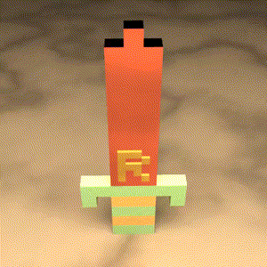
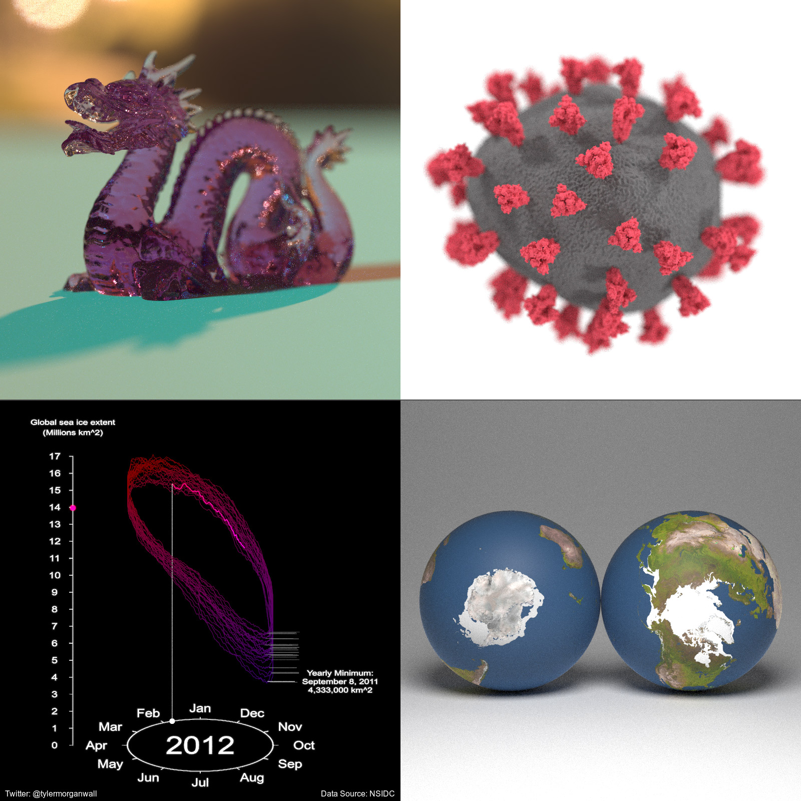

rayrender
=========================================================

<!-- badges: start -->
[](https://github.com/tylermorganwall/rayrender/actions)
[](https://tylermorganwall.r-universe.dev/)
[](https://tylermorganwall.r-universe.dev/rayrender)

<!-- badges: end -->

</img>

Overview
--------

**rayrender** is an open source R package for raytracing scenes in created in R. This package provides a tidy R interface to a fast pathtracer written in C++ to render scenes built out of an array of primitives and meshes. **rayrender** builds scenes using a pipeable iterative interface, and supports diffuse, metallic, dielectric (glass), glossy, microfacet, light emitting materials, as well as procedural and user-specified image/roughness/bump/normal textures and HDR environment lighting. **rayrender** includes multicore support (with progress bars) via RcppThread, random number generation via the PCG RNG, OBJ/PLY support, and denoising support with Intel Open Image Denoise (OIDN).

Browse the documentation and see more examples at the website (if you aren't already there):

<a href="https://www.rayrender.net">rayrender.net</a>

</img>


Installation
------------

```r
# To install the latest version from Github:
# install.packages("devtools")
devtools::install_github("tylermorganwall/rayrender")
```

# Optional: denoising with Intel Open Image Denoise (OIDN)

`rayrender` can use Intel Open Image Denoise to denoise rendered images when OIDN is available on your system.
If OIDN is not found, `rayrender` will still work, just without denoising support.

To get denoising support, you need to install OIDN. You can download the official binaries from Intel and set the `OIDN_PATH` argument in your .Renviron file with the following command line instructions:

## macOS

``` bash
# Download the appropriate binary for your architecture
curl -LO https://github.com/OpenImageDenoise/oidn/releases/download/v2.3.1/oidn-2.3.1.x86_64.macos.tar.gz
# or for Apple Silicon
curl -LO https://github.com/OpenImageDenoise/oidn/releases/download/v2.3.1/oidn-2.3.1.arm64.macos.tar.gz

# Extract the archive
tar -xvzf oidn-2.3.1.x86_64.macos.tar.gz
# or for Apple Silicon
tar -xvzf oidn-2.3.1.arm64.macos.tar.gz

# Set OIDN_PATH in your .Renviron file to the extracted directory
echo "OIDN_PATH=/path/to/extracted/oidn" >> ~/.Renviron
```

## linux

``` bash
# Download the binary
curl -LO https://github.com/OpenImageDenoise/oidn/releases/download/v2.3.1/oidn-2.3.1.x86_64.linux.tar.gz

# Extract the archive
tar -xvzf oidn-2.3.1.x86_64.linux.tar.gz

# Set OIDN_PATH in your .Renviron file to the extracted directory
echo "OIDN_PATH=/path/to/extracted/oidn" >> ~/.Renviron
```

## Windows (Rtools45)

Windows is slightly trickier and requires Rtools45. The steps are:

1. Install `make` and `ninja` via RTools.
2. Install **ISPC** (Intel SPMD Program Compiler).
3. Download the **OIDN** source repository.
4. Compile and install OIDN, and point `rayrender` to it via `OIDN_PATH`.

`OIDN_PATH` should point to a directory that contains `include/OpenImageDenoise` and `lib` (or `lib64`) with the OIDN libraries.

### Install prerequisites

1. Install **Rtools45**
   <https://cran.r-project.org/bin/windows/Rtools/>
2. Open the **“Rtools45 MinGW UCRT64”** shell (ucrt64) in **RTools45**.
3. Inside that shell, install the build tools (including `make`, `ninja`, `cmake`, `git`, and `ispc`) via `pacman`:

```bash
pacman -Sy --needed \
	mingw-w64-ucrt-x86_64-make \
	mingw-w64-ucrt-x86_64-ninja \
	mingw-w64-ucrt-x86_64-cmake \
	mingw-w64-ucrt-x86_64-ispc
```
4. Make sure the Rtools static-posix toolchain and the MinGW binaries are on PATH (this mirrors the setup used to build OIDN):

```bash
export PATH="/c/rtools45/x86_64-w64-mingw32.static.posix/bin:/mingw64/bin:${PATH}"
```

5. Verify the toolchain:

```bash
gcc --version
g++ --version
make --version
ninja --version
cmake --version
ispc --version
```

5. Confirm ISPC is available:

```bash
ispc --version
```

## Build and install OIDN from source (CPU-only)

All of the following commands are run from the **Rtools45 ucrt64 shell**:

```bash
# Download the OIDN source
git clone --recursive https://github.com/RenderKit/oidn.git
cd oidn

# Create a separate build directory
mkdir build-cpu-static
cd build-cpu-static

# Choose an install prefix; use a simple path without spaces
# This will become C:/local/oidn-static on Windows
OIDN_PREFIX="C:/local/oidn-static"

# Configure OIDN with the Rtools static-posix toolchain, CPU-only, static lib
# Update with your rtools45 path.
cmake \
  -G "Ninja" \
  -DCMAKE_BUILD_TYPE=Release \
  -DCMAKE_C_COMPILER="/path/to/rtools45/x86_64-w64-mingw32.static.posix/bin/gcc.exe" \
  -DCMAKE_CXX_COMPILER="/path/to/rtools45/x86_64-w64-mingw32.static.posix/bin/g++.exe" \
  -DOIDN_STATIC_LIB=ON \
  -DOIDN_DEVICE_CPU=ON \
  -DOIDN_DEVICE_SYCL=OFF \
  -DOIDN_DEVICE_CUDA=OFF \
  -DOIDN_DEVICE_HIP=OFF \
  -DOIDN_DEVICE_METAL=OFF \
  -DOIDN_APPS=OFF \
  -DISPC_EXECUTABLE="$(command -v ispc)" \
  -DTBB_DIR="/path/to/rtools45/x86_64-w64-mingw32.static.posix/lib/cmake/TBB" \
  -DCMAKE_INSTALL_PREFIX="${OIDN_PREFIX}" \
  ..
```

If CMake cannot find TBB in Rtools automatically, add a hint such as:

```bash
-DTBB_ROOT=/path/to/rtools45/x86_64-w64-mingw32.static.posix
```
(adjust the path for your actual Rtools45 install) to the `cmake` command above.

Then build and install:

```bash
ninja
ninja install
```

After installation you should have, for example:

```text
C:/local/oidn/include/OpenImageDenoise/oidn.h
C:/local/oidn/lib/libOpenImageDenoise.a   (and related libs)
```

## Tell R where OIDN lives

In a regular Windows shell or PowerShell, add to your user `.Renviron`:

```powershell
echo 'OIDN_PATH=C:/local/oidn' >> "$HOME/.Renviron"
```

or edit the file and add the above manually with `devtools::edit_r_environ()`.

Restart R (or your IDE), then reinstall `rayrender` from source:

```r
devtools::install_github("tylermorganwall/rayrender", force = TRUE)
```

After this, `rayrender` should detect OIDN during `configure` and enable denoising support on Windows.

Usage
-----


We'll first start by rendering a simple scene consisting of the ground, a sphere, and the included `R.obj` file. The location of the `R.obj` file can be accessed by calling the function `r_obj()`. First adding the ground using the `render_ground()` function. This renders an extremely large sphere that (at our scene's scale) functions as a flat surface. We also add a simple blue sphere to the scene.


